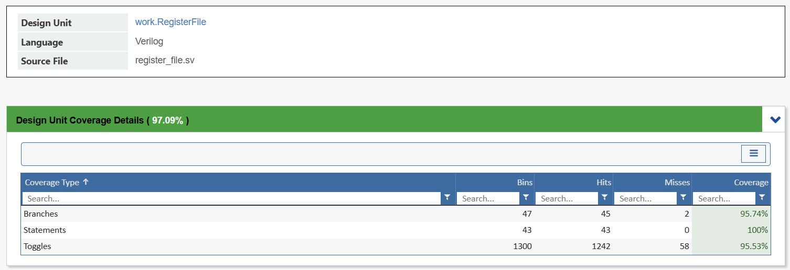

# APB Slave with Register File Verification

A SystemVerilog-based verification environment for an APB slave interface with an integrated register file.

## Overview

This project implements a comprehensive verification testbench for an APB slave device connected to a 16-entry register file. The verification environment uses UVM methodology with constrained-random testing and coverage-driven verification to ensure protocol compliance and functional correctness.

### Key Features
- **APB Protocol**: Setup and Access phase sequencing verification
- **Register File Interface**: Parameterized register file with read/write operations
- **Data Integrity**: End-to-end data path checking
- **Reset Handling**: Asynchronous reset validation
- **Coverage Analysis**: Functional and code coverage reporting

## Architecture

### DUT Interface

| Signal      | Direction | Width | Description                      |
|-------------|-----------|-------|----------------------------------|
| `PCLK`      | Input     | 1     | System clock                     |
| `PRESETn`   | Input     | 1     | Active-low asynchronous reset    |
| `PADDR`     | Input     | 32    | Address bus                      |
| `PWDATA`    | Input     | 32    | Write data bus                   |
| `PWRITE`    | Input     | 1     | Write control signal             |
| `PENABLE`   | Input     | 1     | Access phase enable              |
| `PSELx`     | Input     | 1     | Slave select                     |
| `PSTRB`     | Input     | 4     | Byte strobe                      |
| `PRDATA`    | Output    | 32    | Read data bus                    |
| `PREADY`    | Output    | 1     | Transfer-ready response          |
| `PSLVERR`   | Output    | 1     | Error indication signal          |

## Test Plan

### Test Categories

| Test Type       | Description                                | Priority |
|------------------|--------------------------------------------|----------|
| **Basic Tests**   | Protocol compliance, basic read/write       | High     |
| **Corner Cases**  | Edge addresses, partial strobes             | High     |
| **Stress Tests**  | Back-to-back operations, random sequences   | Medium   |
| **Error Tests**   | Invalid accesses, reset edge cases         | Medium   |

### Key Test Cases
- `apb_basic_test`: Basic APB read/write operations
- `apb_corner_test`: Access boundary registers and partial strobes
- `apb_random_test`: Constrained random testing
- `apb_reset_test`: Reset and recovery verification
- `apb_stress_test`: High-speed back-to-back transactions

## Verification Goals

### Functional Coverage
- **Command Coverage**: Read/write transactions (100%)
- **Address Coverage**: All register addresses (100%)
- **Strobe Coverage**: Full strobe value combinations (100%)

### Assertions
- APB protocol checks (setup/access phase sequencing)
- Register file consistency assertions (e.g., address/data mapping)
- Control signal integrity
- Reset behavior monitoring

## Running Tests

### Coverage Analysis

#### Code Coverage Summary
##### Slave

##### Register File

#### Functional Coverage Summary

## Results

Test results and coverage reports are available in the `Reports/` directory:
- `Fcover_report.txt`: Functional coverage results
- `Scover_report.txt`: Code coverage results
- `assertion_report.txt`: Assertion check summary
